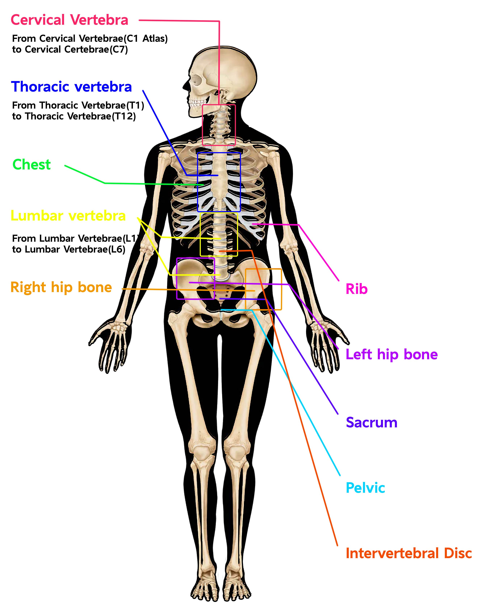

# BoSAM \[[Paper]]

The official repo of "BoSAM".


<div align="center">

| [📚 Overview](#-highlights) | [🛠️ Usage](#-usage) | [🏆 Results](#-results) | [🔬 Benchmark](#open_hands-benchmark) |
|:------------------------:|:-------------------:|:-----------------------:|:-------------------------------------:|
| [🧠 Method](#-method) | [💾 Checkpoint](#-checkpoint) | [👁️ Visualization](#-visualization) |

</div>

<div align="center" style="margin-bottom: 20px;">
  
  <br>
  <em style="color: #666; font-size: 0.9em;">SegBone Benchmark Visualization</em>
</div>

# 💥Highlights

<table>
  <tr>
    <td align="center"><h3>📚 Dataset</h3></td>
    <td align="center"><h3>🚀 Performance</h3></td>
    <td align="center"><h3>🛠️ Pipeline</h3></td>
  </tr>
  <tr>
    <td>
      <p>Largest 3D skeletal segmentation dataset open-sourced</p>
    </td>
    <td>
      <p>Surpassed SOTA models with efficient promptable segmentation</p>
    </td>
    <td>
      <p>Complete workflow: dataset → model → visualization</p>
    </td>
  </tr>
</table>

---

> 💡 **Key Achievements:**
> 1. Pioneering dataset release
> 2. State-of-the-art results
> 3. End-to-end solution


## 🔨 Usage

### Environment set up

First, set up your environment with the following commands:
```
conda create --name bosam python=3.10 
conda activate bosam
pip install light-the-torch && ltt install torch
pip install torchio opencv-python-headless matplotlib prefetch_generator monai edt medim
```


### Training / Fine-tuning
(we recommend fine-tuning with BoSAM pre-trained weights from [link](https://github.com))

To train the BoSAM model on your own data, follow these steps:

#### 0. **(Recommend) Prepare the Pre-trained Weights**

Download the checkpoint from [ckpt section](https://github.com) and move the pth file into `BoSAM/ckpt/`. We provided two types of training weights: original model weights and LoRA fine-tuned weights, offering flexibility in model usage.


#### 1. Prepare Your Training Data (from nnU-Net-style dataset): 

Ensure that your training data is organized according to the structure shown in the `data` directories. The target file structures should be like the following:
```
data
  ├── BoSAM
  │ ├── train
  │ │ ├── imagesTr
  │ │ │ ├── 001.nii.gz
  │ │ │ ├── ...
  │ │ ├── labelsTr
  │ │ │ ├── 002.nii.gz
  │ │ │ ├── ...
  ├── ...
```

Important notes:
1. Ensure that image and label files have matching names (e.g., `001.nii.gz` in both `imagesTr` and `labelsTr`).
2. All images should be in NIfTI format (`.nii.gz`).
3. Maintain consistent naming conventions across all datasets.


Then, modify the `utils/data_paths.py` according to your own data.
```
img_datas = [
"data/BoSAM/train",
...
]
```


#### 2. **Run the Training Script**: 
Run `scripts\bash train.sh` (run `scripts\bash train_lora.sh if you want to Lora fine-tune`) to execute the following command in your terminal:

```
python train.py --multi_gpu --task_name ${tag}`
```
This will start the training process of the BoSAM model on your prepared data. If you use only one GPU, remove the `--multi_gpu` flag.

The key options are listed below:
- tdp: validation data path
- task_name: task name
- checkpoint: pre-trained checkpoint
- work_dir: results folder for log and ckpt
- multi_gpu: use multiple GPU with DDP
- gpu_ids: set gpu ids used for training
- num_epochs: number of epoches
- batch_size: batch size for training
- lr: learning rate for training


**Hint**: Use the `--checkpoint` to set the pre-trained weight path, the model will be trained from scratch if no ckpt in the path is found!

### Evaluation & Inference
Prepare your own dataset according to your specific scenario. Dataset structure remain same as trainging data.
Then you can simply run `scripts\bash val.sh` to **quickly validate** BoSAM on your data.
Or you can use `scripts\bash val_lora.sh` to validate Lora BoSAM on your data

```
python validation.py --seed 2023\
-tdq ./path/to/validation/data \
 -vp ./results/vis \
 -cp ./ckpt/BoSAM.pth \
 --save_name ./results/BoSAM.py
```

- vp: visualization path, dir to save the final visualization files
- cp: checkpoint path
- tdp: test data path, where your data is placed
- save_name: filename to save evaluation results 


## :open_hands: Benchmark

We've open-sourced the SegBone Benchmark, available at [SegBone](www.github.com). It includes three datasets with different test set partitions. For detailed information on the benchmark and datasets, please refer to our [paper](www.github.com). We hope this resource will accelerate research in bone segmentation.

## 🔗 Checkpoint

<!-- | Model | Google Drive | Baidu NetDisk |
|----------|----------|----------|
| SAM-Med3D | [Download](https://drive.google.com/file/d/1PFeUjlFMAppllS9x1kAWyCYUJM9re2Ub/view?usp=drive_link) | [Download (pwd:r5o3)](https://pan.baidu.com/s/18uhMXy_XO0yy3ODj66N8GQ?pwd=r5o3) |
| SAM-Med3D-organ    | [Download](https://drive.google.com/file/d/1kKpjIwCsUWQI-mYZ2Lww9WZXuJxc3FvU/view?usp=sharing) | [Download (pwd:5t7v)](https://pan.baidu.com/s/1Dermdr-ZN8NMWELejF1p1w?pwd=5t7v) |
| SAM-Med3D-brain    | [Download](https://drive.google.com/file/d/1otbhZs9uugSWkAbcQLLSmPB8jo5rzFL2/view?usp=sharing) | [Download (pwd:yp42)](https://pan.baidu.com/s/1S2-buTga9D4Nbrt6fevo8Q?pwd=yp42) |
| SAM-Med3D-turbo    | [Download](https://drive.google.com/file/d/1MuqYRQKIZb4YPtEraK8zTKKpp-dUQIR9/view?usp=sharing) | [Download (pwd:l6ol)](https://pan.baidu.com/s/1OEVtiDc6osG0l9HkQN4hEg?pwd=l6ol) |

Other checkpoints are available with their official link: [SAM](https://drive.google.com/file/d/1_U26MIJhWnWVwmI5JkGg2cd2J6MvkqU-/view?usp=drive_link) and [SAM-Med2D](https://drive.google.com/file/d/1ARiB5RkSsWmAB_8mqWnwDF8ZKTtFwsjl/view?usp=drive_link). -->

## 🗼 Method
<div align="center">  
  
 </div>

## 🏆 Results
### 💡 Overall Performance

| Model              | Prompt    | Resolution   | Dice   |
|--------------------|-----------|--------------|--------|
| TransUNet          |           | 512×512×N    | 77.33  |
| 3D-TransUNet       |           | 128×128×128  | 79.05  |
| SegmentAnyBone(2D) |           | 512×512×N    | 70.30  |
| SegmentAnyBone     |           | 128×128×128  | 71.02  |
| SAM                | 10 points | 512×512×N    | 16.75  |
| SAM-Med2D          | 10 points | 256×256×N    | 18.14  |
| SAM-Med3D          | 1 point   | 128×128×128  | 25.43  |
| SAM-Med3D          | 5 points  | 128×128×128  | 54.73  |
| SAM-Med3D          | 10 points | 128×128×128  | 61.76  |
| SAM-Med3D-turbo    | 1 point   | 128×128×128  | 39.05  |
| SAM-Med3D-turbo    | 5 points  | 128×128×128  | 62.41  |
| SAM-Med3D-turbo    | 10 points | 128×128×128  | 67.49  |
| **BoSAM**          | 1 point   | 128×128×128  | **81.68** |
| **BoSAM**          | 5 points  | 128×128×128  | **82.71** |
| **BoSAM**          | 10 points | 128×128×128  | **83.01** |

Comparison with SOTA 3D segmentation models


### 💡 Visualization
<div align="center">
  
</div>


<!-- ## 📬 Citation
```
@misc{wang2023sammed3d,
      title={SAM-Med3D}, 
      author={Haoyu Wang and Sizheng Guo and Jin Ye and Zhongying Deng and Junlong Cheng and Tianbin Li and Jianpin Chen and Yanzhou Su and Ziyan Huang and Yiqing Shen and Bin Fu and Shaoting Zhang and Junjun He and Yu Qiao},
      year={2023},
      eprint={2310.15161},
      archivePrefix={arXiv},
      primaryClass={cs.CV}
}
``` -->

## 🎫 License
This project is released under the [Apache 2.0 license](LICENSE). 


## 🙏 Acknowledgement
- We thank all medical workers and dataset owners for making public datasets available to the community.
- Thanks to the open-source of the following projects:
  - [Segment Anything](https://github.com/facebookresearch/segment-anything) &#8194;
  - [SAM-Med2D](https://github.com/OpenGVLab/SAM-Med2D/tree/main)
  - [SAM-Med3D](https://github.com/uni-medical/SAM-Med3D)

